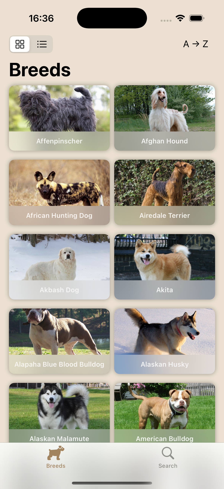
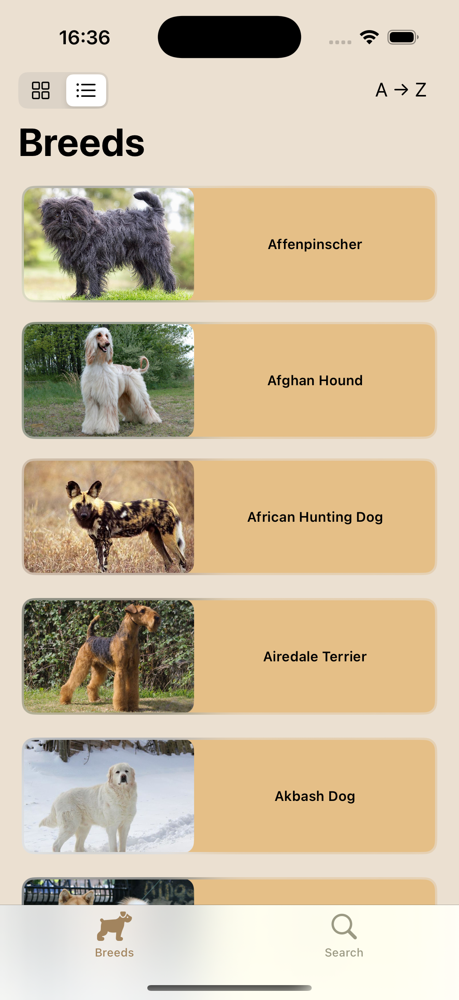
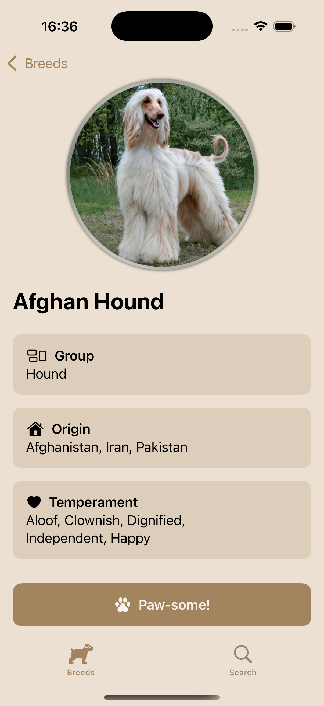
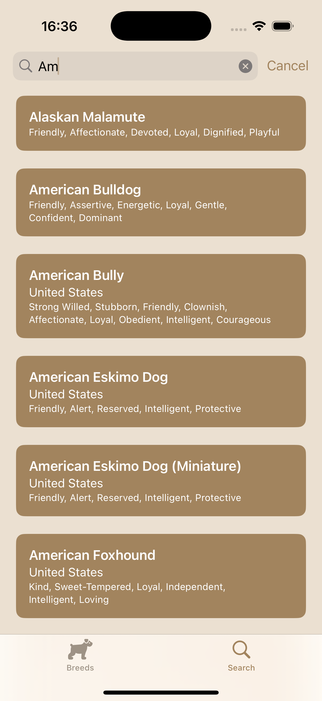

# dog-api-challenge

The "Dog Breed Finder" app let's the users find and explore breeds. It uses the [The Dog API](https://thedogapi.com) API to provide the information.

The app features include:

-   Explore the breed images through different layouts - grid and list
-   Pagination and alphabetical order
-   Search breeds by their name
-   Check some breed details

|                                           |                                           |                                                 |                                               |
| ----------------------------------------- | ----------------------------------------- | ----------------------------------------------- | --------------------------------------------- |
|  |  |  |  |

The app was build using SwiftUI and uses [Nuke](https://github.com/kean/Nuke) for image loading and caching.
